# Prctica-Tema 4 Installació i Configuració de Moodle
En aquesta pràctica he creat un portal Moodle de temàtica lliure, configurant-lo i explorant-ne les funcionalitats com a administrador.
## 1. Configuració inicial de Moodle

Per fer aquest apartat de la pràctica, he iniciat la sessió com a administrador i havia canviat el meu correu electrònic i la contrasenya seguint aquests passos:

Per començar he fet click en el **Logo** del meu perfil del *Moodle*, i després en l’opció de **"Perfil/Profile"**  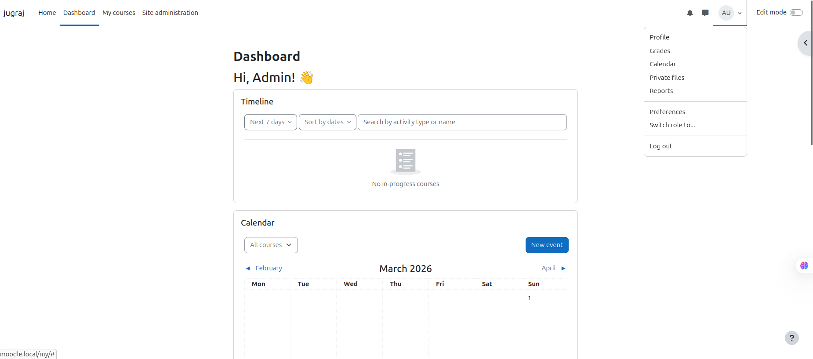
 - Una vegada dins de l’apartat de perfil, hem de fer clic a **"Edit Profile"**
  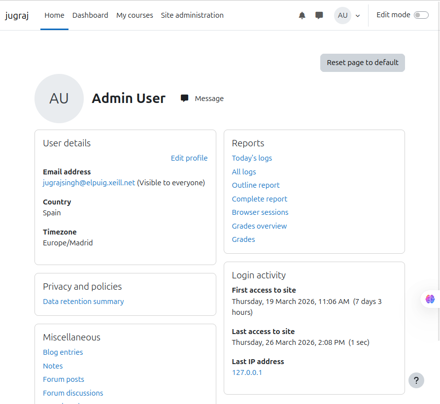
- En aquest apartat ja ens sortirà l’opció de configurar les nostres dades com: "correu electrònic, nom, contrasenya..."
  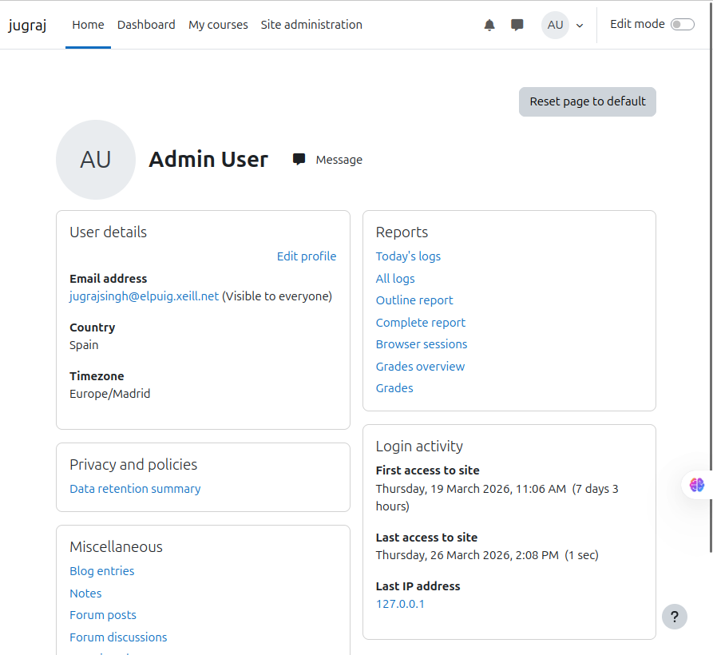

## 2. Configuració del lloc
En el punt *2* he canviat el nom del lloc i també he fet que la pàgina principal no mostri contingut per als usuaris no autenticats amb aquests passos: # - Primer de tot iniciem la sessio com **Administrador** en *Moodle*.
 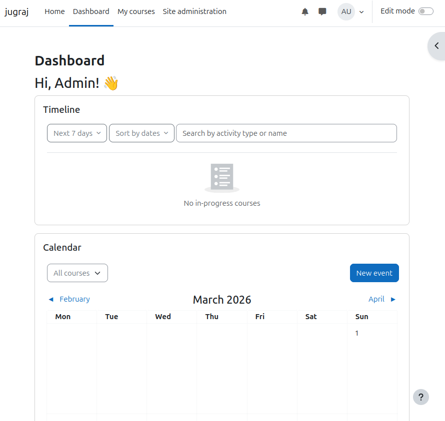
 - Ara anem a **Administració del lloc > Primera plana > Paràmetres.**
 - Després configurem la franja horaria correcta:  Ubicació > Paràmetres.
 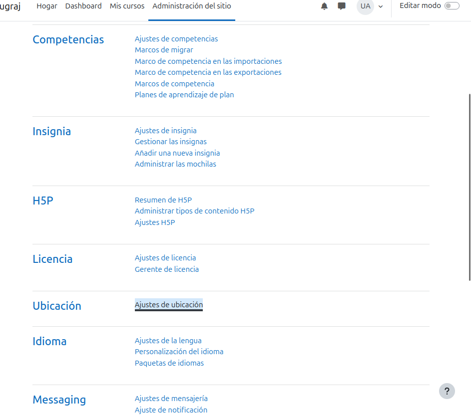
 - Jo, per exemple he escollit ***Europe/Madrid***
 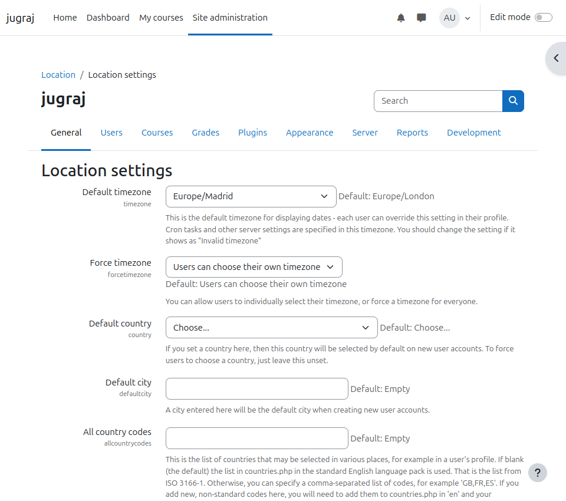
- Ara ens falta canviar l'idioma del lloc:
 - Instal·lem paquets d'idioma si cal des de Administració del lloc > Idioma > Paquets d'idioma.
 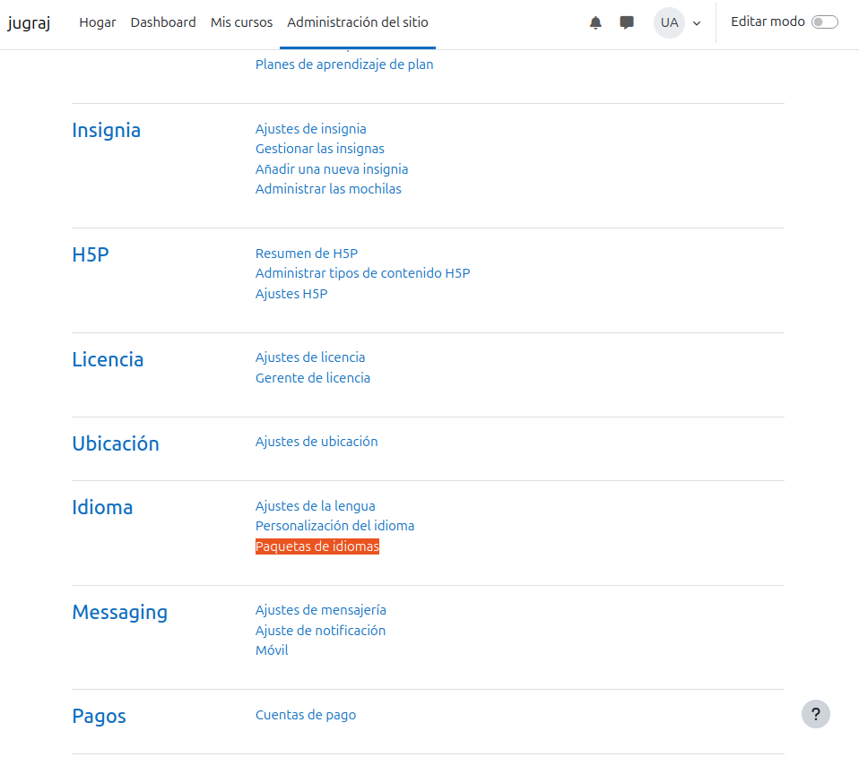
 - Aquí escollim l'idioma que nosaltres volem; jo he escollit "Espanyol". Després fem un clic en "Install selected language pack(s)"
  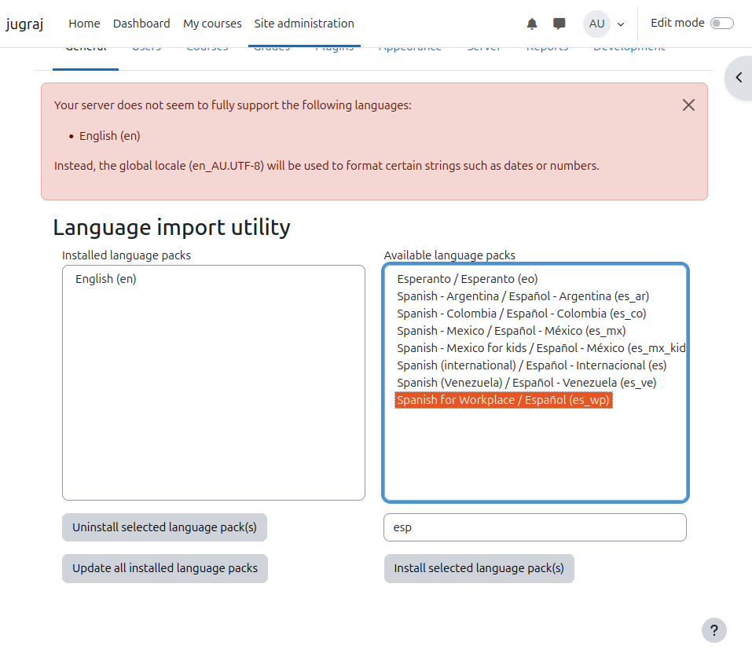

- Anem a Administració del lloc > Idioma > Paràmetres.
 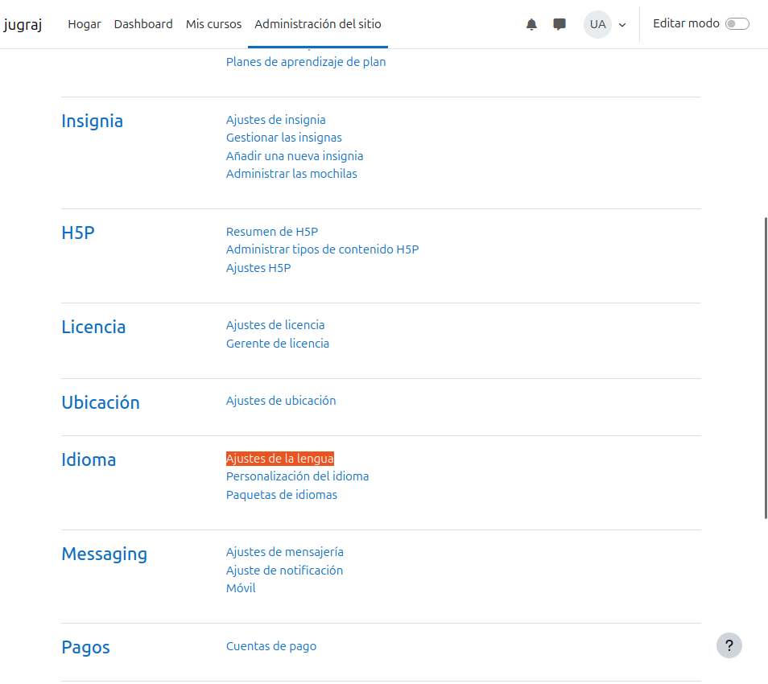
- Aqui escollim l'idioma que hem descarregat. Despres de escollir ho baixem i fem click en ***Save changes***
 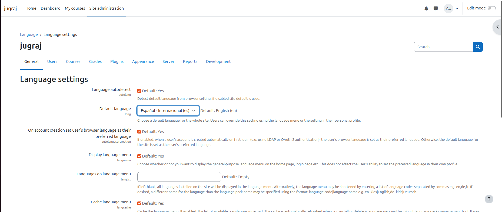
## Establim una política de contrasenyes robusta:
- Anem a Administració del lloc > Seguretat > Normatives del lloc.
  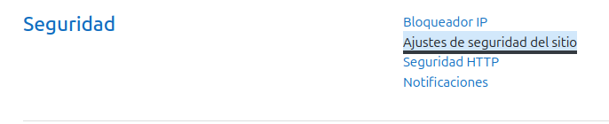
- Despres baixem un poc i pusem un **1** en els opcions que volem per a que siguin **certs** y **0** en els que no volem:
    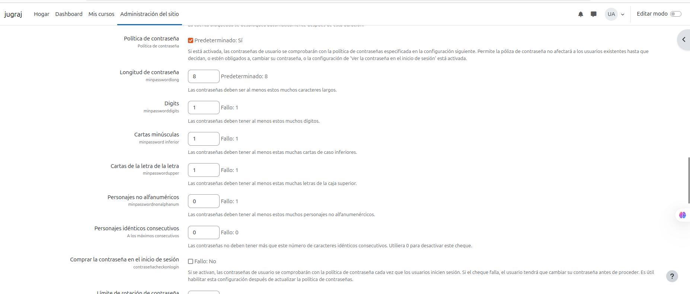
  Despres baixem un altre vegada per guardar els canvis.

# 3. Creació de cursos
En aquest punt tenim que crear ***Cursos*** seguint els pasos següents:
### ***Accediu a quadre de navegació: Cursos > Afegeix curs.***

- Creem un curs anomenat A amb 3 temes.
  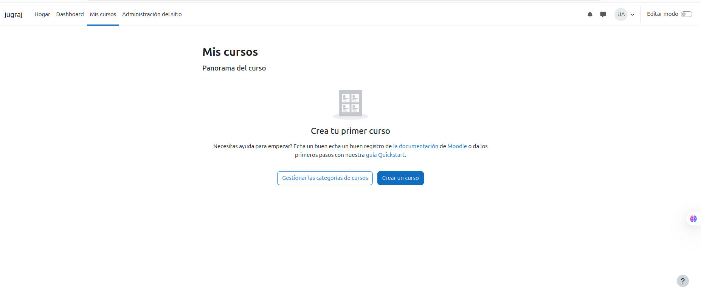
  Aqui fem click en **Crear un curso**
  Despres de aixo tenim que fer click en ***Añadir seccion*** i posem el nom que volem. ex: Tema1,2,3...
  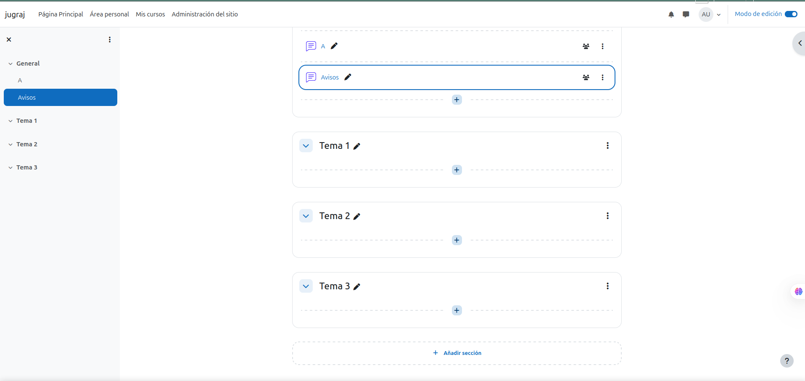

- Despres creem un curs anomenat B amb 5 temes.
fem aquesta part de la activitat de la mateixa manera que el pasat
  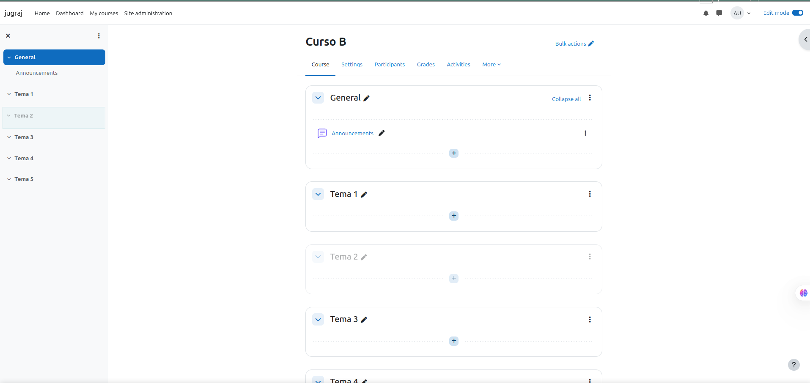

# 3.1 Exploreu les opcions de personalització dels cursos:

- Activeu el mode edició (Botó Activar Edició).
- Afegiu material (per exemple, un document PDF) a algun tema.
  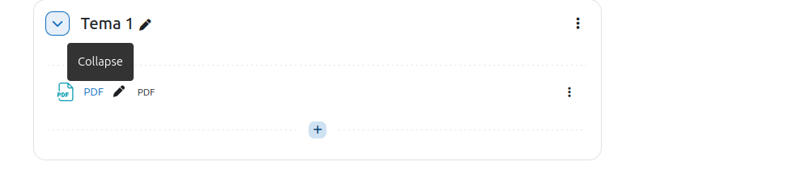
- Canvieu el títol d'algun tema.
  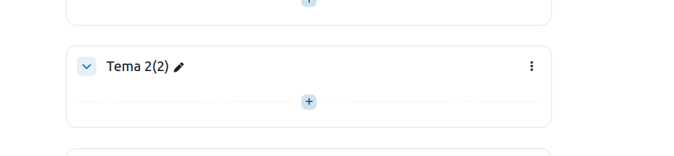

4.1. Creació manual d'usuaris
Creeu manualment un usuari anomenat Bob amb autenticació manual:
Anar a Administració del lloc > Usuaris > Comptes > Afegeix un usuari.
  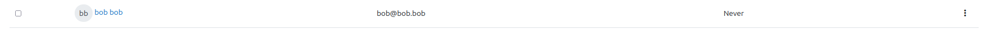

