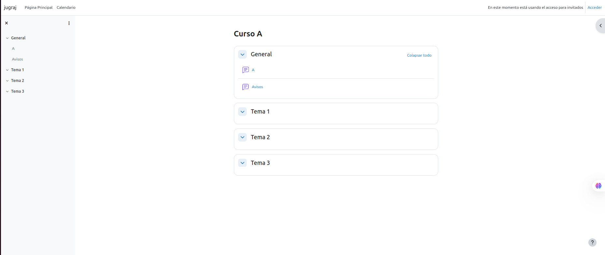
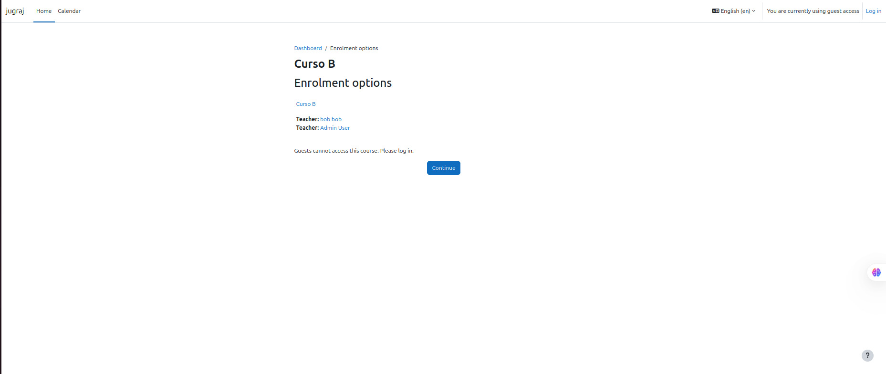
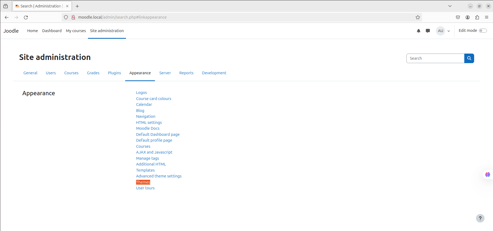
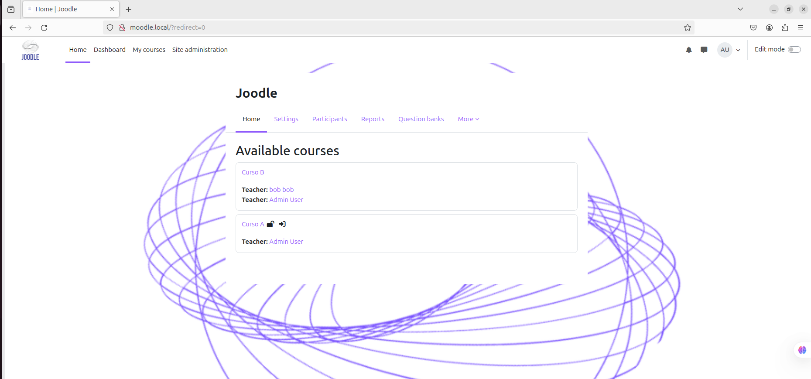

## 1. Configuració inicial de Moodle

Per fer aquest apartat de la pràctica, he iniciat la sessió com a administrador i havia canviat el meu correu electrònic i la contrasenya seguint aquests passos:

Per començar he fet click en el **Logo** del meu perfil del *Moodle*, i després en l’opció de **"Perfil/Profile"**  
 - Una vegada dins de l’apartat de perfil, hem de fer clic a **"Edit Profile"**
  
- En aquest apartat ja ens sortirà l’opció de configurar les nostres dades com: "correu electrònic, nom, contrasenya..."
  

## 2. Configuració del lloc
En el punt *2* he canviat el nom del lloc i també he fet que la pàgina principal no mostri contingut per als usuaris no autenticats amb aquests passos: # - Primer de tot iniciem la sessio com **Administrador** en *Moodle*.
 
 - Ara anem a **Administració del lloc > Primera plana > Paràmetres.**
 - Després configurem la franja horaria correcta:  Ubicació > Paràmetres.
 
 - Jo, per exemple he escollit ***Europe/Madrid***
 
- Ara ens falta canviar l'idioma del lloc:
 - Instal·lem paquets d'idioma si cal des de Administració del lloc > Idioma > Paquets d'idioma.
 
 - Aquí escollim l'idioma que nosaltres volem; jo he escollit "Espanyol". Després fem un clic en "Install selected language pack(s)"
  

- Anem a Administració del lloc > Idioma > Paràmetres.
 
- Aqui escollim l'idioma que hem descarregat. Despres de escollir ho baixem i fem click en ***Save changes***
 
## Establim una política de contrasenyes robusta:
- Anem a Administració del lloc > Seguretat > Normatives del lloc.
  
- Despres baixem un poc i pusem un **1** en els opcions que volem per a que siguin **certs** y **0** en els que no volem:
    
  Despres baixem un altre vegada per guardar els canvis.

# 3. Creació de cursos
En aquest punt tenim que crear ***Cursos*** seguint els pasos següents:
### ***Accediu a quadre de navegació: Cursos > Afegeix curs.***

- Creem un curs anomenat A amb 3 temes.
  
  Aqui fem click en **Crear un curso**
  Despres de aixo tenim que fer click en ***Añadir seccion*** i posem el nom que volem. ex: Tema1,2,3...
  

- Despres creem un curs anomenat B amb 5 temes.
fem aquesta part de la activitat de la mateixa manera que el pasat
  

# 3.1 Exploreu les opcions de personalització dels cursos:

- Activeu el mode edició (Botó Activar Edició).
- Afegiu material (per exemple, un document PDF) a algun tema.
  
- Canvieu el títol d'algun tema.
  

4.1. Creació manual d'usuaris
Creeu manualment un usuari anomenat Bob amb autenticació manual:
Anar a Administració del lloc > Usuaris > Comptes > Afegeix un usuari.
  

# 4. Creació i gestió d'usuaris

4.2. Creació massiva d'alumnes
- Genereu 10 alumnes utilitzant un arxiu CSV:
- Anar a Administració del lloc > Usuaris > Carrega usuaris.
- Consulteu l'exemple de fitxer CSV a la secció Usuaris.
- Elimineu dos dels alumnes creats mitjançant Accions amb usuaris en bloc.
  

# 5. Matriculació d'usuaris als cursos

5.1. Configuració de mètodes d'inscripció
- Curs A:
Desactiveu qualsevol mètode d'inscripció per fer-lo públic.
El curs ha de ser accessible sense iniciar sessió.

- Curs B:
Activeu el registre manual d'usuaris.
Matriculeu l'usuari Bob com a professor i els alumnes restants com a estudiants.

5.2. Verificació
Comproveu que:
El contingut del curs A està disponible públicament.

Per accedir al curs B, cal iniciar sessió.

# 6. Personalització del lloc

Per a cambiar de Tema de ***Moodle*** anem a Site Administration --> Appereance --> Themes

Una vegada aqui escollim un de aquestes.

Logotip:

Afegiu un logotip al vostre Moodle:
Jo he escollit aquest logo que diu ***"Joodle"*** que es un nom personalitzat per a mi.

### Look Final: 

# 7.1. Curs A
Assigneu un professor i matriculeu alumnes.

Afegiu continguts:
Diferents tipus d'activitats i recursos.
Una tasca amb data d'entrega oberta que demani la càrrega d'un fitxer PDF.

7.2. Curs B
Cloneu el contingut del curs A al curs B:
Anar a Administració del curs > Importar.
Per a importar del Curs A --> Curs B tenim que anar al curs on volem importar y despres fer click en ***Mas*** y escollir ***"Course reuse"*** despres escullim el curs (Curs A en aquest cas) y fem click en import

# 8. Qualificacions i insígnies
Qualificacions:

Completeu totes les tasques evaluables amb un usuari alumne.

Configureu el calificador per obtenir una nota automàtica:

Anar a Administració del curs > Configuració de qualificacions.
Insígnies:

Creeu una insignia i atorgueu-la a un alumne:
Anar a Administració del lloc > Insígnies.
En aquest apartat de la activitat he creat una insignia anomenat ***Top*** per als estudiants que tinguin bona nota.
Per fer aquest apartat he anat a ***Curs A*** y despres he fet click en mas, una vegada alli he fet click en ***Insignias*** i he creat aquesta.

# 9. Qüestionaris
Creeu un qüestionari amb preguntes del banc de preguntes:
Per fer aixo he tingut que anar al Curs A

Despres he fet click en ***Mas*** y en el menuhe fet click en **Banco de preguntas**

Una vegada aqui he fet clck en ***Añadir*** y he afegit les preguntes.

Organitzeu preguntes en categories diferents.
Respongueu les preguntes amb un usuari estudiant i verifiqueu les qualificacions amb l'usuari professor.

