## 1. Configuració inicial de Moodle

Per fer aquest apartat de la pràctica, he iniciat la sessió com a administrador i he canviat el meu correu electrònic i la contrasenya.

Per començar, he fet click en el **logo** del meu perfil de *Moodle* i després en l’opció de **"Perfil/Profile"**  

- Una vegada dins del perfil, he fet clic a **"Edit Profile"**  
  

- En aquest apartat he pogut modificar les meves dades personals com el correu electrònic, el nom i la contrasenya.  
  

- Després, en la part inferior, he vist l’opció de canviar la foto de perfil, però en el meu cas no l’he modificada.  
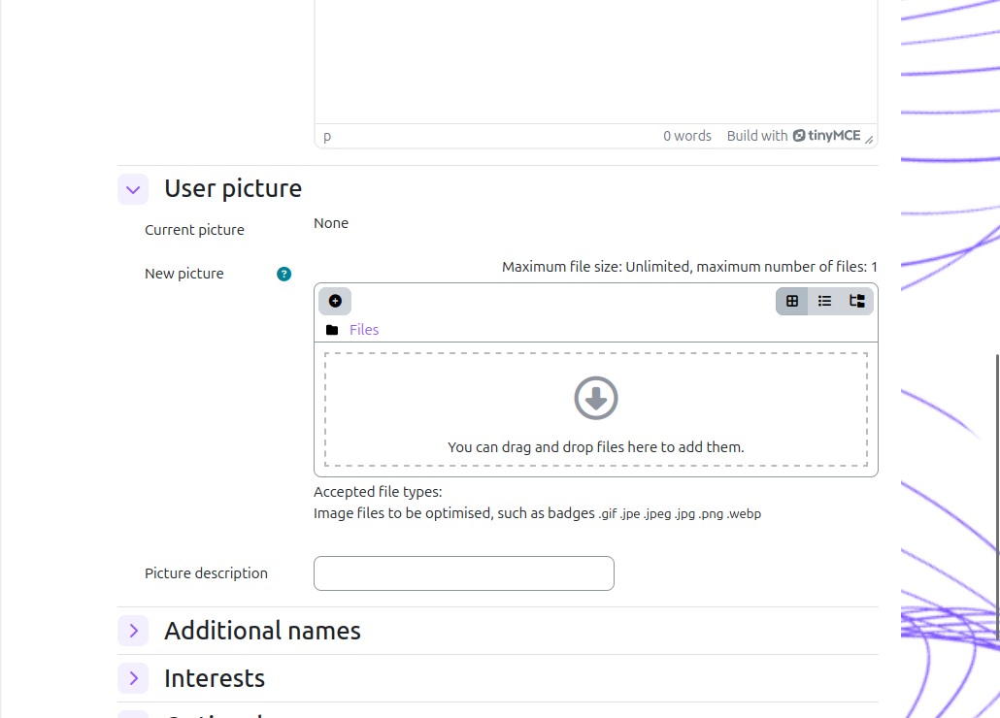

## 2. Configuració del lloc

En aquest apartat he configurat diferents paràmetres generals del Moodle com a administrador.

Primer he iniciat sessió com a **Administrador**.  

- Després he anat a **Administració del lloc > Primera plana > Paràmetres** i he canviat el nom del lloc i la configuració de la pàgina principal.

- A continuació he configurat la zona horària des de **Ubicació > Paràmetres**, i he seleccionat ***Europe/Madrid***.  

- Després he canviat l’idioma del sistema. Primer he instal·lat el paquet d’idioma des de **Administració del lloc > Idioma > Paquets d’idioma**.  

- He seleccionat l’idioma “Espanyol” i he fet clic a "Install selected language pack(s)".  

- Després he configurat l’idioma des de **Administració del lloc > Idioma > Paràmetres** i he guardat els canvis.  

### Política de contrasenyes
- He anat a **Administració del lloc > Seguretat > Normatives del lloc**.  

- En aquest apartat he activat les opcions necessàries posant **1** per activar-les i **0** per desactivar-les.  

Després he guardat els canvis.

## 3. Creació de cursos

En aquest apartat he creat els cursos demanats.

- Primer he anat a **Cursos > Afegeix curs** i he creat un curs anomenat A amb 3 temes.  

- Després he fet clic a **Crear un curso** i he afegit les seccions amb el nom dels temes (Tema 1, 2 i 3).  

- A continuació he creat un altre curs anomenat B amb 5 temes seguint el mateix procediment.  

## 3.1 Personalització dels cursos

En aquest apartat he modificat els cursos per afegir contingut i personalitzar-los.

- He activat el mode edició amb el botó **Activar edició**.
- Després he afegit un document PDF dins d’un tema.  

- També he canviat el títol d’algun tema per organitzar millor el contingut.  

## 4. Creació i gestió d'usuaris

### 4.1 Creació manual

He creat manualment un usuari anomenat Bob.

- He anat a **Administració del lloc > Usuaris > Comptes > Afegeix un usuari**.  

### 4.2 Creació massiva

- He creat 10 alumnes mitjançant un fitxer CSV.
- Per fer-ho he anat a **Administració del lloc > Usuaris > Carrega usuaris**.
- Després he eliminat dos usuaris en bloc.  
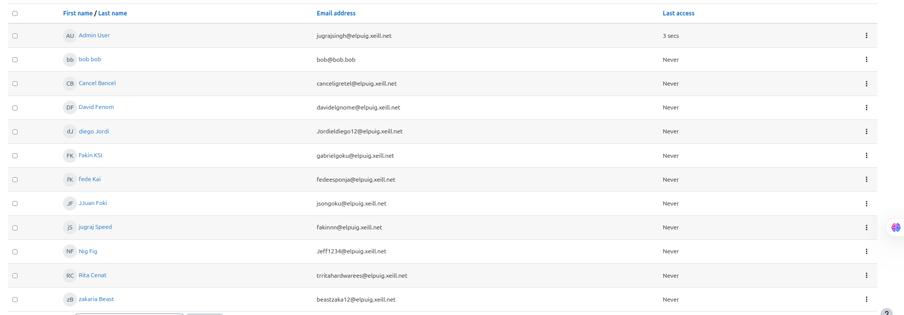

## 5. Matriculació d’usuaris

### Curs A
- He desactivat els mètodes d’inscripció perquè el curs sigui públic.  
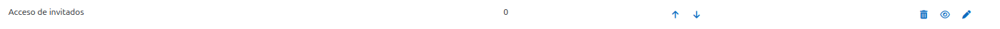

### Curs B
- He activat la matriculació manual.
- He matriculat l’usuari Bob com a professor i la resta com a estudiants.  
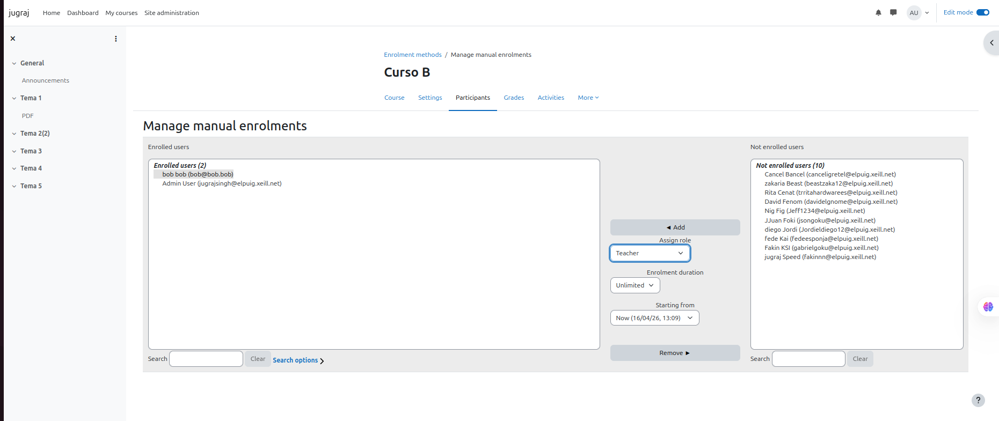

## 6. Personalització del lloc

- He canviat el tema del Moodle des de **Appearance > Themes**.  
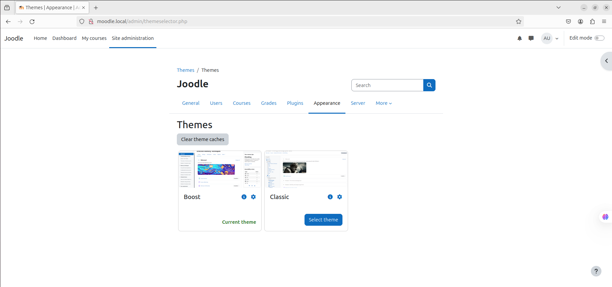

- Després he seleccionat un tema dels disponibles.  
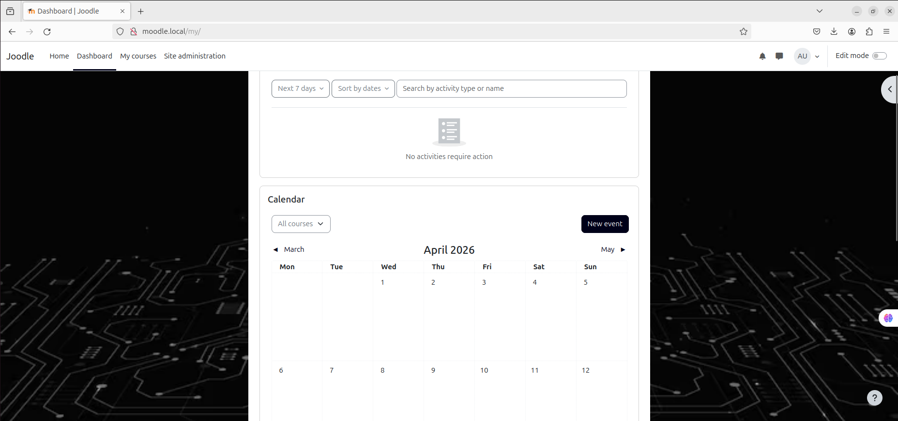

- També he afegit un logotip personalitzat anomenat "Joodle".  

## 7.1 Curs A

- He assignat un professor i he matriculat els alumnes.  
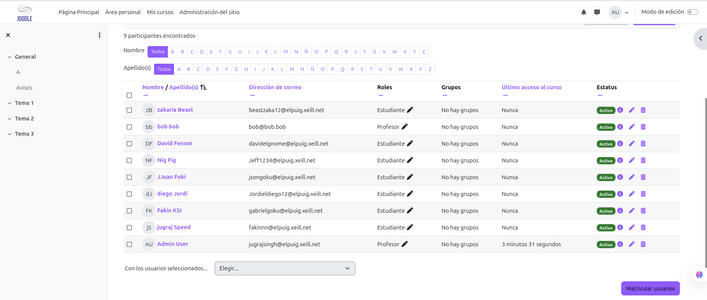

- Després he afegit activitats i recursos, incloent una tasca amb entrega de PDF.  
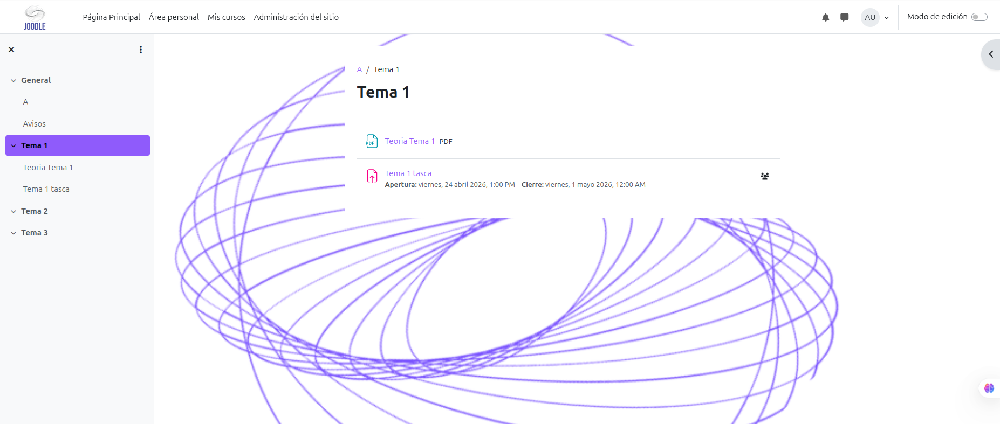

## 7.2 Curs B

- He importat el contingut del curs A al curs B.
- Per fer-ho he anat a **Mas > Course reuse > Import** i he seleccionat el curs A.  
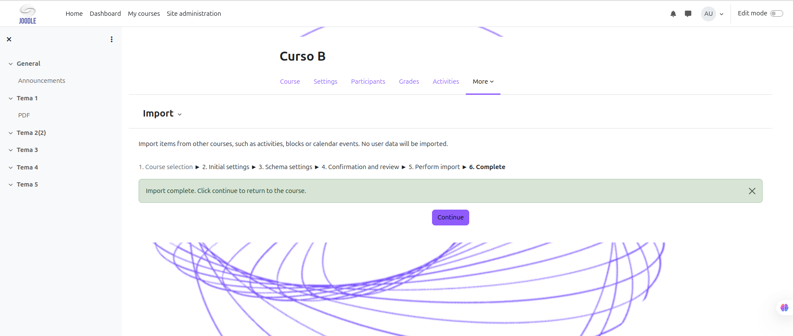

## 8. Qualificacions i insígnies

- He completat les tasques amb un usuari alumne.  
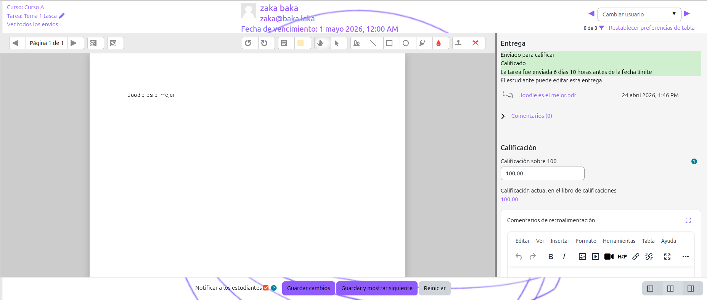

- He configurat el sistema de qualificacions automàtiques.  
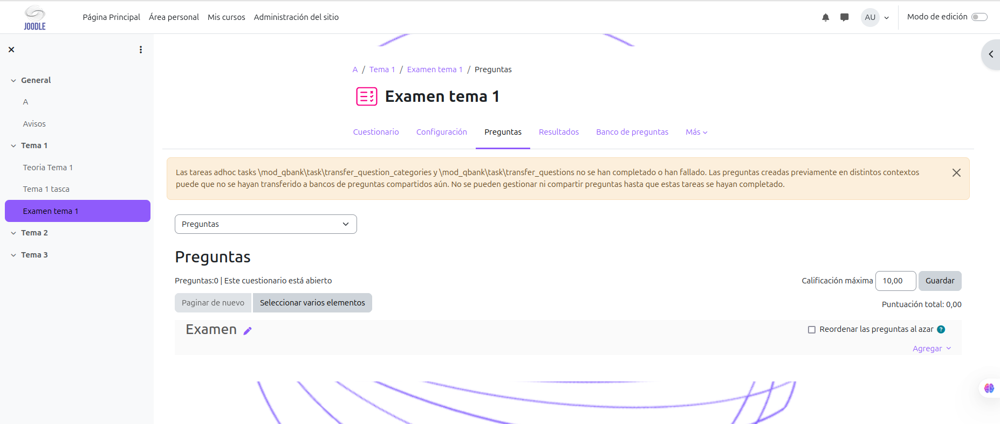

- També he creat una insígnia anomenada "Top" i l’he assignat a alumnes amb bona nota.  
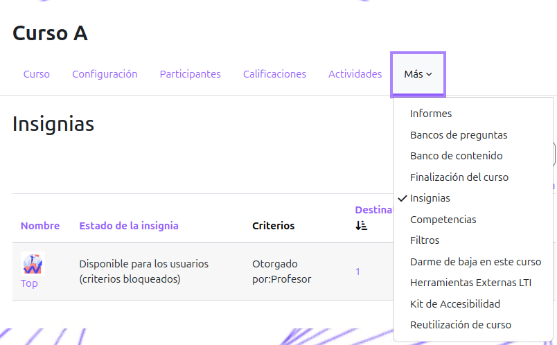

## 9. Qüestionaris

- He creat un qüestionari dins del curs A.  

- Després he accedit a **Mas > Banco de preguntas**.  
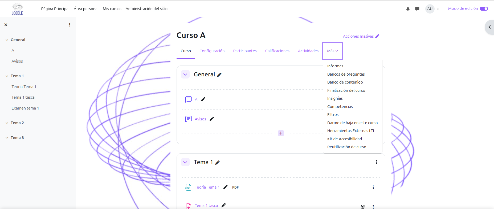

- He afegit preguntes i les he organitzat per categories.

- Finalment he fet la prova amb un usuari alumne i he comprovat les qualificacions amb el professor.
